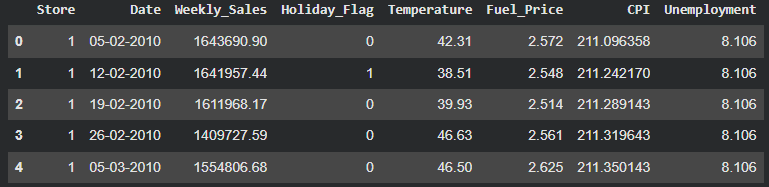
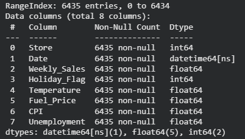
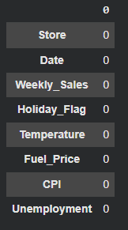
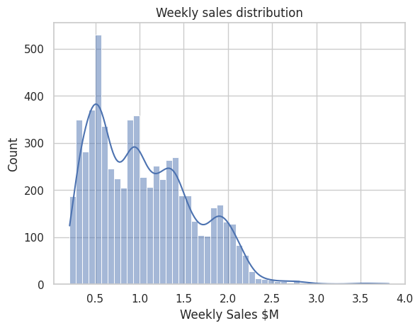
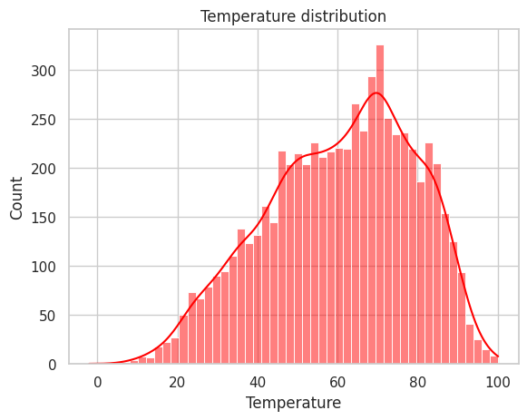
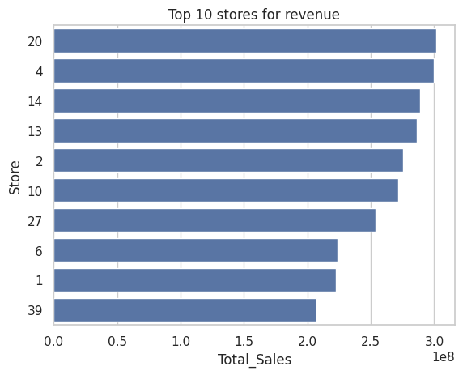
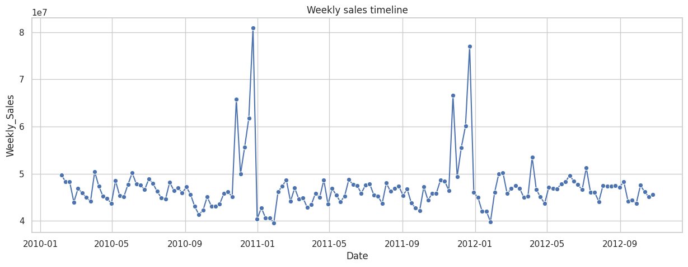
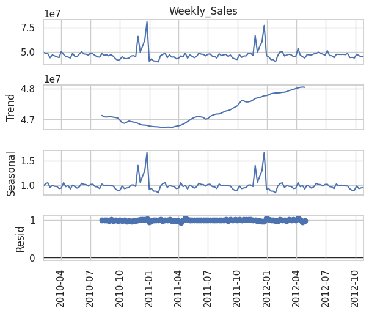
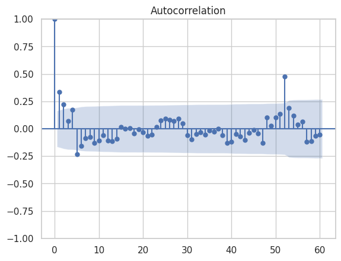
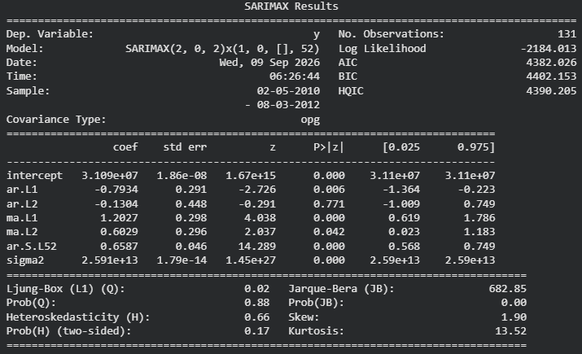

# Retail sales Forecasting
## Project overview
This project explores weekly sales forecasting for retail stores using time series analysis techniques. The objective is to identify seasonal sales patterns, evaluate the impact of external economic factors, and build predictive models capable of forecasting future sales performance.

The project combines:

 - Exploratory Data Analysis (EDA)
 - Seasonal decomposition
 - Autocorrelation analysis
 - SARIMA forecasting
 - SARIMAX forecasting with external regressors
 - Forecast evaluation and model comparison
 - Future sales prediction

## Business problem
Retail demand is heavily influenced by seasonality and external economic conditions. Accurately forecasting sales allows organizations to:

 - Improve inventory planning
 - Optimize staffing levels
 - Anticipate seasonal demand peaks
 - Support strategic decision-making

This project investigates whether Walmart sales can be accurately forecasted using historical sales data and macroeconomic indicators.

## Dataset
The origin dataset contains weekly sales for many stores along with several external factors:
 - Weekly Sales
 - Fuel Price
 - Consumer Price Index (CPI)
 - Unemployment Rate
 - Holiday Flag

 The data covers approximately two and a half years of weekly observations.

## Data cleaning and validation
The origin dataset has been loaded from Kaggle.

These are the columns available after the astype check:

No null values have been found:

## Exploratory Data Analysis

The numeric values in the data table have been studied to determine any anomaly in the dataset, the following are histograms for some of these data:

Then, in the EDA activity, the stores with most overall sales have been classified:

Weekly sales generally fluctuate between 40M and 50M dollars, with significant peaks occurring during holiday periods:

## Seasonality
Seasonal decomposition revealed recurring annual patterns, especially during the end-of-year holiday season.

The ACF plot showed a significant spike at lag 52, indicating an annual seasonal cycle and supporting the use of a seasonal time series model.

## Forecasting
A SARIMA model was developed to capture:

 - Trend
 - Seasonality over 52 weeks
 - Temporal dependencies

The results are the following, that suggest using a model SARIMA (2,0,2)(1,0,0,52):

## Tools used
 - Pandas
 - NumPy
 - Matplotlib
 - Seaborn
 - pmdarima
 - Scikit-learn
